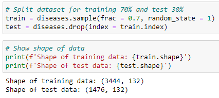
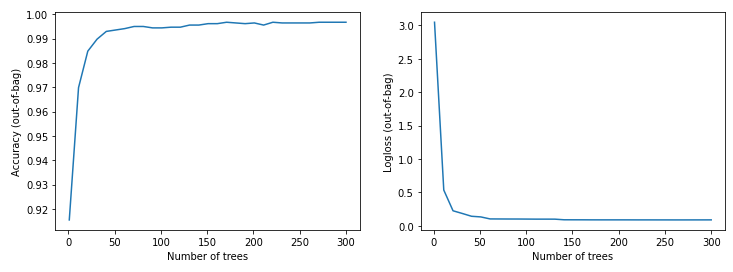
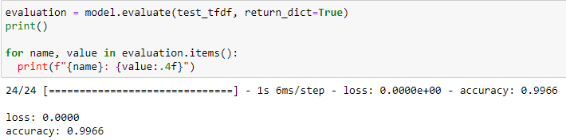

<!--
*** WELCOME TO HIPOTESA PROJECT
*** Thanks for checking out the Hipotesa Project Readme. If you have a suggestion
*** that would make this better, please fork the repo and create a pull request
*** or simply open an issue with the tag "enhancement".
*** Thanks again! Now go create something AMAZING! :D
-->

<!-- COLOR CODE: 082c4e -->

<p align="center">
    
</p>

<!-- PROJECT LOGO -->
<br />
<p align="center">
  <a href="http://www.hipotesa.tech/">
    
  </a>

  <h3 align="center">Hipotesa Algorithm</h3>

  <p align="center">
    An AI based healthcare system aims to help patients to detect their disease at an early stage to be able to identify the treatment plan early on and help them secure a good way to live.
    <br />
    <a href="https://github.com/davindb/HipotesaProject#readme"><strong>Go to the project »</strong></a>
    <br />
    <br />
    <a href="https://github.com/davindb/HipotesaAlgorithm/">View Demo</a>
    ·
    <a href="http://www.hipotesa.tech/">Our Website</a>
    ·
    <a href="https://github.com/davindb/HipotesaAlgorithm/#contributing">Contribute</a>
    ·
     <a href="https://github.com/davindb/HipotesaAlgorithm/issues">Report Bug</a>
  </p>
</p>

<!-- TABLE OF CONTENTS -->
<details open="open">
  <summary><h2 style="display: inline-block">Table of Contents</h2></summary>
  <ol>
    <li>
      <a href="#about-the-project">About The Project</a>
      <ul>
        <li><a href="#built-tools">Built Tools</a></li>
      </ul>
    </li>
    <li>
      <a href="#getting-started">Getting Started</a>
      <ul>
        <li><a href="#prerequisites">Prerequisites</a></li>
        <li><a href="#installation">Installation</a></li>
        <li><a href="#dataset">Dataset</a></li>
      </ul>
    </li>
    <li><a href="#algorithm">Algorithm</a>
      <ul>
        <li><a href="#method-explanation">Method Explanation</a></li>
      </ul>
    </li>
    <li><a href="#build-the-model">Build The Model</a></li>
    <li><a href="#results">Results</a></li>
    <li><a href="#other-repositories">Other Repositories</a></li>
    <li><a href="#our-machine-learning-team">Our Machine Learning Team</a></li>
    <li><a href="#contributing">Contributing</a></li>
    <li><a href="#license">License</a></li>
    <li><a href="#acknowledgements">Acknowledgements</a></li>
    <li><a href="#copyright">Copyright</a></li>
  </ol>
</details>

<!-- ABOUT THE PROJECT -->

## About The Project

There are a lot of diseases that you need to detect at an early stage to be able to identify the treatment plan early on and help the patient secure a good way to live. An early detection of disease and a precise diagnosis allows for quicker action, saving precious time, and to prevent complications and rapid worsening. Health practitioners have conducted surveys and collected data on patient information, their disease, and symptoms that allow them to distinguish the patient's disease with common symptoms. Therefore, the data set can be used to train the model that can predict the disease based on the symptoms.

In this project we create an **Android Native Mobile Application** with the resources are supported by **Google Cloud Platform**. We imlemented a **Machine Learning Model** that requires data containing a list of symptoms. Our system then will find out what disease the patients have and what treatments they should take.

<!-- RESOURCES -->

### Built Tools

- [Python](https://www.python.org/)
- [Jupyter Notebook](https://jupyter.org/)
- [Tensorflow](https://www.tensorflow.org/)
- [Tensorflow Decision Forests](https://www.tensorflow.org/decision_forests)
- [Pandas](https://pandas.pydata.org/)
- [Numpy](https://numpy.org/)
- [Matplotlib](https://matplotlib.org/)

<!-- GETTING STARTED -->

## Getting Started

This is an overview of Hipotesa Algorithm, what the prequisites are, how the algorithm works, data visualization, model testing, and more.

### Prerequisites

- Python 3.7.x - 3.9.x (we use python version 3.9.5)
- TensorFlow Decision Forests (available for linux and WSL)
- Setting up the environment and the requirements.txt

### Installation

We recommend you to install it on the linux machine (for windows user you are recommended to use Windows Subsystem Linux (WSL) or just use Google Colab)

1. Clone the repository
   ```sh
   $ git clone https://github.com/davindb/HipotesaAlgorithm.git
   #change directory to the repository folder
   $ cd HipotesaAlgorithm
   ```
2. Install required packages
   ```sh
   $ pip install -r requirements.txt
   ```
3. You can run this project on your local machine using jupyter notebook
   ```sh
   $ jupyter-notebook
   ```

### Dataset

This is the original dataset:

- [Disease Symptom Prediction](https://www.kaggle.com/itachi9604/disease-symptom-description-dataset)

We used and improved the **Disease Symptom Prediction** dataset that provided on Kaggle. We improved the data because there were misspelling words on the data. We recommend you to just use the dataset from our repositories.

## Algorithm

This is the explanation of the algorithm used by Hipotesa, how the algorithm works and how we built the model.

We implemented the brand new library from TensorFlow which is TensorFlow Decision Forests (TF-DF). The algorithm that we use is the **Random Forest** algorithm.

### Method Explanation

- Random Forest Algorithm

<p align="center">
    
</p>

Random forest is a supervised machine learning algorithm consisting of many decision trees that operate as an ensemble. It can be used for both regression and classification tasks. In this algorithm, there is no need to specify an architecture (for example, by trying different combinations of layers like in a neural network). Even with default hyperparameters already give high accuracy. Once the model is trained, we can directly plot the accuracy. We use this model for classification tasks and work well with tabular data. Our task is to classify the diseases based on its symptoms. So that's why this algorithm will be suited well with this kind of problem.

## Build The Model

First, we preprocessed the data using **Pandas** and **Numpy** before we fitted the data to the model. We specified which was the label and which were the features. After that, we splitted the data into two things, the training data and the test data. We splitted it by 70% for the training data and 30% for the test data. As you can see on the figure of the shape of the data below.

<p align="center">
    
</p>

After that, we converted those data to the TensorFlow Datasets to be able to be fitted to the model and the model could be trained.

## Results

After the model was successfully trained, we plotted the training process to the graph of accuracy to the number of trees. The graph is shown below.

<p align="center">
    
</p>

After that, we saved the model to the TensorFlow SavedModel and imported the model to be evaluated using the test data. The evaluation test accuracy that we got was `99.66%` which is exactly like the given figure below.

<p align="center">
    
</p>

Since we thought the model was already good enough, we decided to continue the project to the next step which was the API deployment by the Cloud Computing team.

## Other Repositories

Check our other repositories to know more about Hipotesa.

- [Hipotesa Project](https://github.com/davindb/HipotesaProject)
- [Hipotesa Application]()
- [Hipotesa Rest API & Cloud Management](https://github.com/Guscah/HipotesaRestAPI)

<!-- TEAM MEMBERS -->

## Our Machine Learning Team

|            Member             | Student ID |       Project Role        |                                                  Contacts                                                  |
| :---------------------------: | :--------: | :-----------------------: | :--------------------------------------------------------------------------------------------------------: |
| Davin Darmalaksana Bhagaspati |  M0111153  | Machine Learning Engineer | [![davin-linkedin][linkedin-shield]][davin-linkedin-url][![davin-github][github-shield]][davin-github-url] |
|    Ihsan Nafilah Ramdhani     |  M0111152  | Machine Learning Engineer | [![ihsan-linkedin][linkedin-shield]][ihsan-linkedin-url][![ihsan-github][github-shield]][ihsan-github-url] |

<!-- CONTRIBUTING -->

## Contributing

Contributions are what make the open source community such an amazing place to be learn, inspire, and create. Any contributions you make are **greatly appreciated**.

1. Fork the Project
2. Create your Feature Branch (`git checkout -b feature/AmazingFeature`)
3. Commit your Changes (`git commit -m 'Add some AmazingFeature'`)
4. Push to the Branch (`git push origin feature/AmazingFeature`)
5. Open a Pull Request

<!-- LICENSE -->

## License

Distributed under the MIT License. See `LICENSE` for more information.

<!-- ACKNOWLEDGEMENTS -->

## Acknowledgements

We are very grateful to all of those with whom we have had the pleasure to work during this and other related projects especially [Bangkit Academy](https://grow.google/intl/id_id/bangkit/) who supported for doing this project. Each of the team members of this project has provided the team extensive personal and professional guidance about both scientific research and life in general especially in healthcare related fields.

<p align="center" style="padding-top: 5px">
  <a href="https://grow.google/intl/id_id/bangkit/">
    
  </a>
  &nbsp;&nbsp;&nbsp;&nbsp;&nbsp;&nbsp;
  <a href="http://www.hipotesa.tech/">
    
  </a>
</p>

<!-- COPYRIGHT -->

## Copyright

Kreasi Anak Bangsa group © Copyright 2021 | All Rights Reserved.

<!-- MARKDOWN LINKS & IMAGES -->
<!-- https://www.markdownguide.org/basic-syntax/#reference-style-links -->

<!-- LINKED IN -->

[linkedin-shield]: https://img.shields.io/badge/LinkedIn--blue?style=social&logo=Linkedin
[davin-linkedin-url]: https://www.linkedin.com/in/davindb/
[ihsan-linkedin-url]: https://www.linkedin.com/in/ihsanramdhani/
[agus-linkedin-url]: https://www.linkedin.com/in/aguscahya/
[fadia-linkedin-url]: https://www.linkedin.com/in/fadia-fatta-dylla-326998113/
[raved-linkedin-url]: https://www.linkedin.com/in/ravedya/

<!-- GITHUB -->

[github-shield]: https://img.shields.io/badge/GitHub--blue?style=social&logo=Github
[davin-github-url]: https://github.com/davindb
[ihsan-github-url]: https://github.com/ihsanramdhani
[agus-github-url]: https://github.com/Guscah
[fadia-github-url]: https://github.com/fadiafattadyllaaa
[raved-github-url]: https://github.com/ravedya

<!-- OTHERS -->

[contributors-shield]: https://img.shields.io/github/contributors/davindb/HipotesaAlgorithm.svg?style=for-the-badge
[contributors-url]: https://github.com/davindb/HipotesaAlgorithm/graphs/contributors
[forks-shield]: https://img.shields.io/github/forks/davindb/HipotesaAlgorithm.svg?style=for-the-badge
[forks-url]: https://github.com/davindb/HipotesaAlgorithm/network/members
[stars-shield]: https://img.shields.io/github/stars/davindb/HipotesaAlgorithm.svg?style=for-the-badge
[stars-url]: https://github.com/davindb/HipotesaAlgorithm/stargazers
[issues-shield]: https://img.shields.io/github/issues/davindb/HipotesaAlgorithm.svg?style=for-the-badge
[issues-url]: https://github.com/davindb/HipotesaAlgorithm/issues
